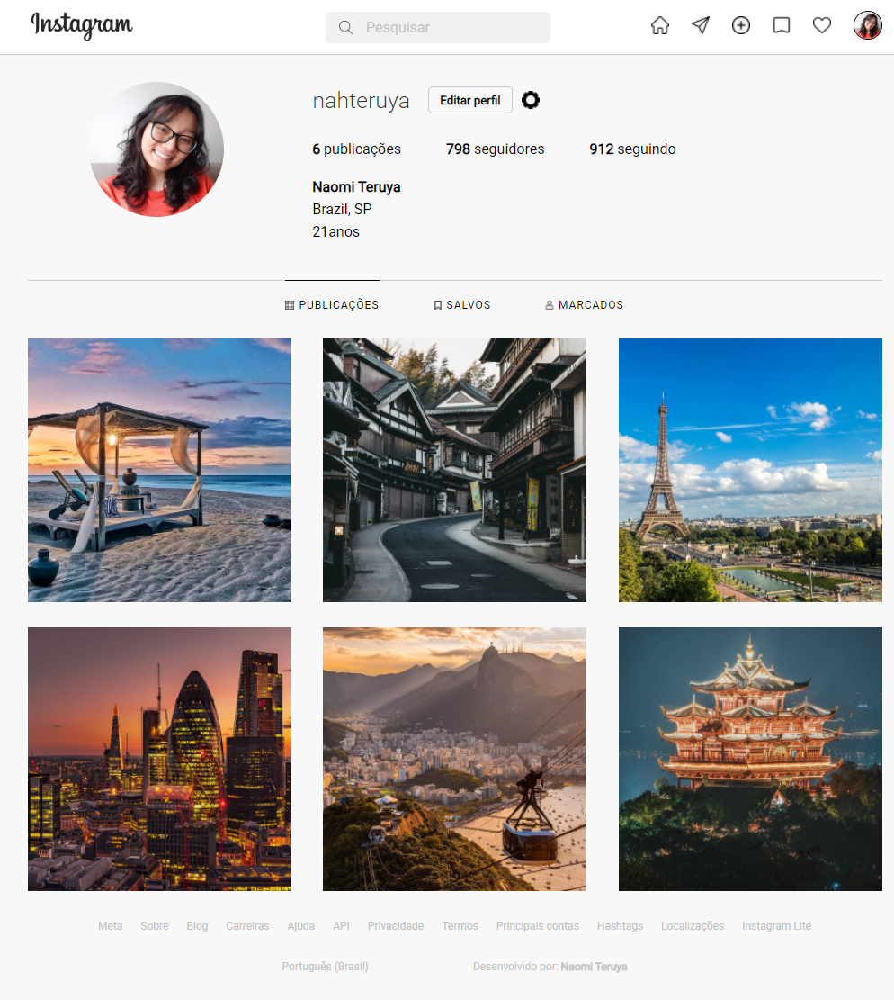

# Recriando a página de perfil do Instagram

Desafio proposto no módulo de Introdução a HTML e CSS do Bootcamp Spread Fullstack Developer oferecido pela DIO em parceria com a Spread. O objetivo do projeto é recriar a página de perfil de usuário do Instagram, aplicando os conhecimentos em tags HTML e posicionamento de elementos com flexbox em CSS.

 

Tecnologias utilizadas:  

